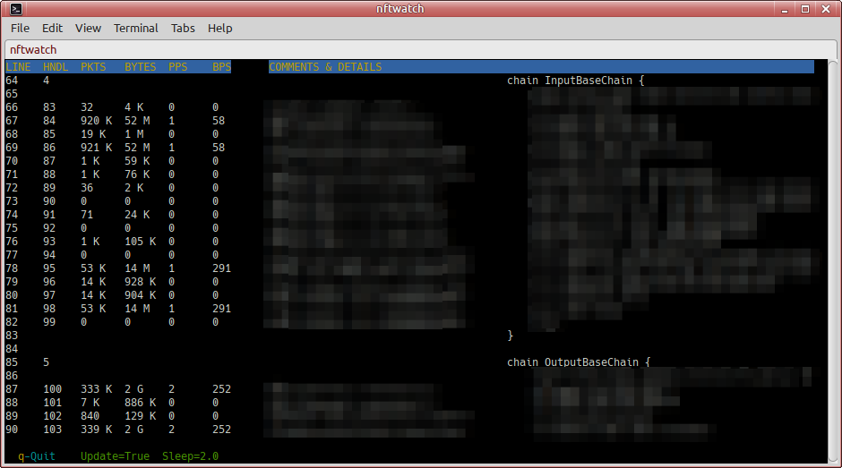

nftwatch
========

Copyright (C) 2021-2022 Kenneth Aaron.

flyingrhino AT orcon DOT net DOT nz

Freedom makes a better world: released under GNU GPLv3.

https://www.gnu.org/licenses/gpl-3.0.en.html

This software can be used by anyone at no cost, however,
if you like using my software and can support - please
donate money to a children's hospital of your choice.

This program is free software: you can redistribute it
and/or modify it under the terms of the GNU General Public
License as published by the Free Software Foundation:
GNU GPLv3. You must include this entire text with your
distribution.

This program is distributed in the hope that it will be
useful, but WITHOUT ANY WARRANTY; without even the implied
warranty of MERCHANTABILITY or FITNESS FOR A PARTICULAR
PURPOSE.
See the GNU General Public License for more details.

About nftwatch
--------------

* Shows nftables policy in a more readable format.
* Live counters table.
* User-configurable refresh speed.
* Pause display refresh.

Manual install instructions
---------------------------

* Clone/download the project from the git repository.
* Copy:  `/etc/nftwatch.yml`    .
* Copy:  `/usr/local/bin/nftwatch`  and:  +x  it.
* `nftwatch`  with no args to run it.
* `nftwatch -m`  for this man page.

Configuring nftwatch
--------------------

Some configs are in:  `nftwatch.yml`    .
Others are hardcoded into the code - subject to improvement.
Config file will be loaded from these paths - whichever
is found first. If no config file is found - builtin
defaults will be used.
It's safe to run nftwatch without a config file.

* ~/.config/nftwatch/nftwatch.yml
* ~/.nftwatch.yml
* ~/nftwatch.yml
* /etc/nftwatch.yml

Controls
--------

nftwatch is designed for interactive use. Simply run it
and it will start displaying your nftables stats.

The following keyboard controls are available:

- f:                Speed up the display refresh
- s:                Slow down the display refresh
- p:                Pause the display refresh
- .:                Toggles comment dot padding
- Up arrow or N:    Scroll the table up
- Down arrow or n:  Scroll the table down
- Home or g:        Jump to table top
- End or G:         Jump to table bottom
- PgUp or b:        Page up in the table
- PgDn or space:    Page down in the table
- Ctrl-q or q:      Quit

Man page
--------

* `nftwatch -m`  for this man page.

Usage tips
----------

* If you see something interesting - pause the display
and scroll the table if needed.
* Add counters to your nftables rules if you want to see
these values in nftwatch (by default rules don't have
counters).
* Slow down your display refresh rate to get more accurate
results, as well as pickup rules that are rarely hit.
At faster refresh rates your BPS/PPS rates will be
higher than reality because the time it takes to read and
calculate values is not accounted for (nftwatch uses
simple division by refresh time per cycle).
* If short comments make it difficult to follow the line -
toggle dot padding with:  `.`  to improve readability.
Change will apply at next table redraw.

Troubleshooting
---------------

Increase the logging verbosity with:  `nftwatch -d`
or permanently increase it in the code by changing this
line:  `LogLevel = logging.DEBUG`    .
Check  `journalctl -f`  for nftwatch logs.

On rare occasions nftwatch exits and leaves the terminal
messed up. Fix this by typing:  `reset`  in the terminal.
I tried to fix this at the end of function:  main
but I still see it happen 5% of the time when running fast
refresh rates.
If anyone knows a solution please tell me.

Limitations
-----------

- This is the first release of nftwatch.
- There could be bugs.
- It can be improved.
- Features can be added.
- nftwatch is tied to the nft output. Any changes in nft
output will break nftwatch.
- Supports up to 9999 lines/nft-handles before display may
get messed up. Should be enough for most use cases though.
- The first cycle after changing refresh speed will be
incorrect; the second cycle onwards will be fine until
you change refresh speed again.
- nftwatch is not a performance measurement tool - there
are a few factors that prevent the BPS and PPS rates from
being accurate, but as a rules troubleshooting assistant -
it is close enough to be useful.

I initially wrote nftwatch because I wanted a realtime
running output from nftables that was better than simply
looping it through:  `watch`. As of now - nftwatch serves
its purpose. Let's see what feature requests I receive and
if nftwatch can be improved for more use cases.

